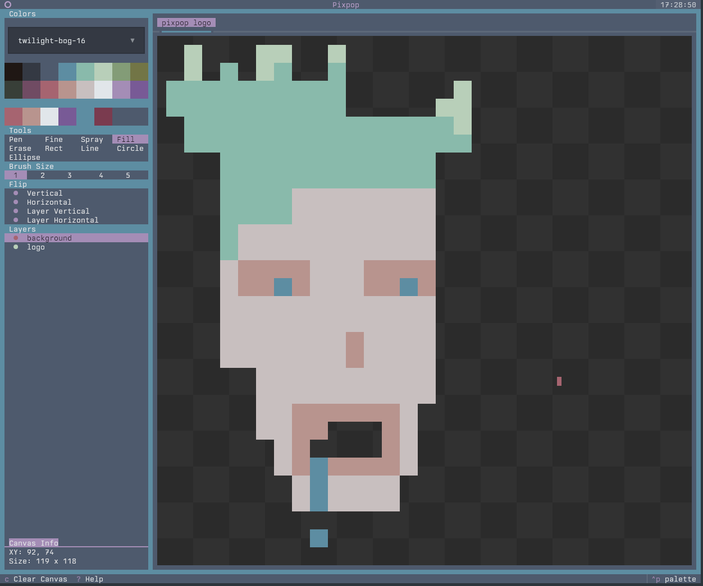
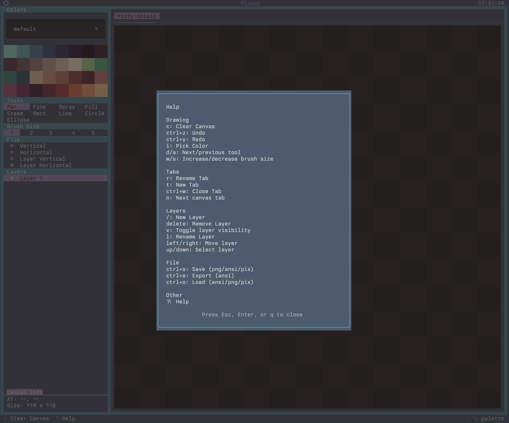

# Pixpop 

A TUI paint application built with Python 3.14 and the
[Textual](https://textual.textualize.io/) framework.

## Features

- Multiple canvases
- Multiple layers
- Full mouse and keyboard support (drawing is mouse-only)
- Configuration file for application defaults
- Save and export as .ans, .png, and .pix session files
- Open and load .ans, .png, and .pix session files
- Undo-redo stack
- Help screen and tooltips

## Caveats

This application is designed to draw in the terminal, which comes with limitations.
We are able to draw `pixels` (half-characters), but there is no way to know if the mouse is positioned
on the top or bottom pixel. To work around this we have the fine tool.
It allows choosing the top pixel with left-click, the bottom pixel with right-click, and both pixels with middle-click.

## Screenshots

<table>
  <tr>
    <td></td>
    <td></td>
  </tr>
</table>

## Pixpop session format (.pix)

Pixpop supports saving and loading full sessions as `.pix` files. These are
gzipped JSON files that capture:

- Tabs (canvas names and order)
- Canvas size per tab
- Layers, visibility, and pixel data
- Undo/redo stacks per tab
- Shared tool state and palette selection

The `.pix` format is intended for restoring a working session rather than
exporting artwork. For artwork exports, use PNG or ASCII.


## Setup

```bash
git clone https://github.com/umbsublime/pixpop.git
cd pixpop
uv sync
uv run pixpop
```

## Project structure

```
pixpop/
├── src/pixpop/         # Application package
│   ├── styles/         # Textual CSS
│   ├── screens/        # Modal dialogs
│   ├── state/          # App state, messages, undo/redo
│   ├── tools/          # Drawing tools and registry
│   ├── widgets/        # UI pickers (tool/color/brush/spray/layer)
│   ├── session/        # .pix session save/load
│   └── importers/      # PNG / PIX / ANSI loaders
├── src/assets/         # Palettes and word lists (bundled)
├── tests/              # Snapshot + regression tests
├── assets/             # Project logo and screenshots
└── pyproject.toml
```

## Development

### Code quality (Ruff)

```bash
# Lint
uv run ruff check src/

# Auto-fix
uv run ruff check --fix src/

# Format
uv run ruff format src/
```

## Testing

Snapshot tests cover the UI. Run them with:

```bash
uv run pytest
```

Update baselines for intentional UI changes:

```bash
uv run pytest --snapshot-update
```

Always verify changes by running the app:

```bash
uv run pixpop
```

## Powered by

- [textual](https://github.com/Textualize/textual): TUI framework powering the app shell and widgets.
- [textual-canvas](https://github.com/davep/textual-canvas): Pixel canvas widget used for drawing operations.
- [textual-fspicker](https://github.com/davep/textual-fspicker): File picker dialogs for save/load flows.
