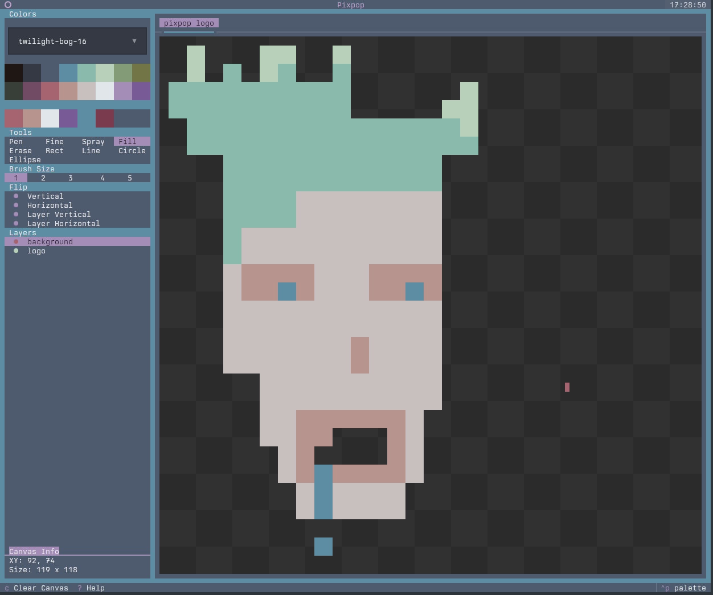

# Pixpop

**A TUI paint application built with Python 3.14 and the [Textual](https://textual.textualize.io/) framework.**

Draw pixel art without ever leaving your terminal.



## Features

- :material-tab: **Multiple canvases** — work on several pieces at once with tabs
- :material-layers: **Multiple layers** — stack, reorder, hide, and rename layers
- :material-mouse: **Full mouse and keyboard support** — drawing is mouse-only, everything else has a [shortcut](shortcuts.md)
- :material-cog: **Configuration file** — set application [defaults](configuration.md) via TOML
- :material-content-save: **Save & export** — `.ans`, `.png`, and `.pix` [session files](file-formats.md)
- :material-folder-open: **Open & load** — import `.ans`, `.png`, and `.pix` files
- :material-undo: **Undo/redo stack** — per-tab history
- :material-help-circle: **Built-in help** — press ++question++ anywhere for the shortcut reference

## Quick start

```bash
git clone https://github.com/umbsublime/pixpop.git
cd pixpop
uv sync
uv run pixpop
```

See [Getting Started](getting-started.md) for a full tour.

## The half-character caveat

Pixpop draws in the terminal using *half characters*: each terminal cell is two
stacked pixels (`▀`). The mouse can only report which **cell** it is over — not
whether it is on the top or bottom pixel of that cell. The
[Fine pen](tools.md#fine-pen) works around this:

- **Left-click** paints the top pixel
- **Right-click** paints the bottom pixel
- **Middle-click** paints both pixels

## Powered by

- [textual](https://github.com/Textualize/textual) — TUI framework powering the app shell and widgets
- [textual-canvas](https://github.com/davep/textual-canvas) — pixel canvas widget used for drawing
- [textual-fspicker](https://github.com/davep/textual-fspicker) — file picker dialogs for save/load flows
