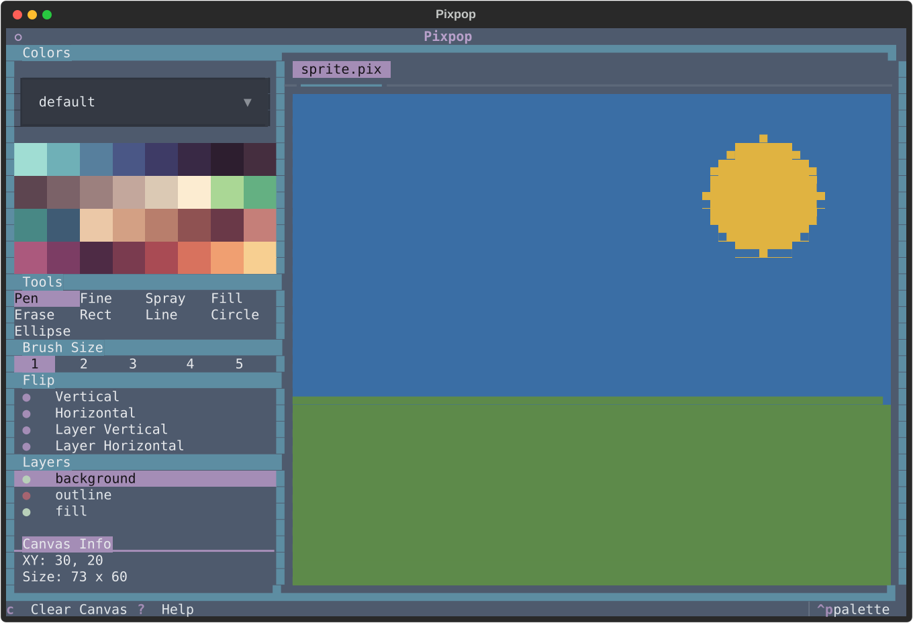

# Layers

Each canvas has its own stack of layers, composited from bottom to top.
Layers let you separate outlines from fills, experiment safely, and toggle
parts of your artwork on and off.

## Managing layers

All layer operations are available from the layer picker and the keyboard:

| Action | Keys | Notes |
|---|---|---|
| New layer | ++slash++ | Added above the active layer |
| Remove layer | ++delete++ | Removes the active layer |
| Rename layer | ++l++ | Opens a rename dialog |
| Toggle visibility | ++v++ | Hidden layers are not composited or exported |
| Select previous | ++up++ | |
| Select next | ++down++ | |
| Move up the stack | ++left++ | Drawn later (on top) |
| Move down the stack | ++right++ | Drawn earlier (behind) |

## Behavior notes

- The **active layer** is the one all drawing tools paint on. Its name is
  highlighted in the picker.
- The number of layers per canvas is limited by
  [`max_layers`](configuration.md#max_layers) (default: 10).
- Layers are part of the [`.pix` session format](file-formats.md) — names,
  order, visibility, and pixel data are all preserved when you save.
- Exporting to [PNG or ANSI](file-formats.md) composites only **visible**
  layers.

!!! tip
    Keep your outline on its own layer. You can hide it to check how the
    artwork reads without lines, or move the fill layers up and down without
    touching the linework.
