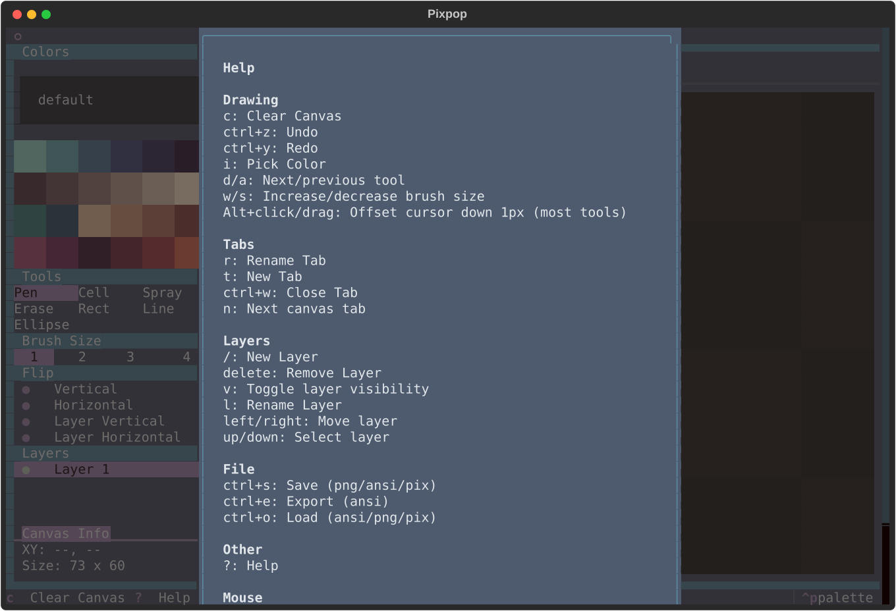

# Keyboard Shortcuts

Every action in Pixpop is available from the keyboard. Drawing itself is
mouse-only; the keyboard drives tools, layers, tabs, and file operations.

Press ++question++ inside the app to open the built-in help dialog — it is
generated from the live keymap, so it always matches your version.

## Files

| Keys | Action |
|---|---|
| ++ctrl+s++ | Save canvas |
| ++ctrl+e++ | Export canvas (PNG / ANSI) |
| ++ctrl+o++ | Load canvas from file |

## Tabs

| Keys | Action |
|---|---|
| ++t++ | New tab |
| ++n++ | Switch to next tab |
| ++r++ | Rename active tab |
| ++ctrl+w++ | Close active tab |

## Layers

| Keys | Action |
|---|---|
| ++slash++ | New layer |
| ++delete++ | Remove active layer |
| ++l++ | Rename active layer |
| ++v++ | Toggle active layer visibility |
| ++up++ | Select previous layer |
| ++down++ | Select next layer |
| ++left++ | Move layer up the stack |
| ++right++ | Move layer down the stack |

## Tools & brush

| Keys | Action |
|---|---|
| ++d++ | Next tool |
| ++a++ | Previous tool |
| ++w++ | Increase brush size |
| ++s++ | Decrease brush size |
| ++i++ | Pick color (eyedropper) |
| ++p++ | Open color picker modal |

## Canvas

| Keys | Action |
|---|---|
| ++c++ | Clear canvas |
| ++ctrl+z++ | Undo |
| ++ctrl+y++ | Redo |

## View

| Keys | Action |
|---|---|
| ++f++ | Toggle canvas fullscreen |

## Mouse reference

Drawing is mouse-only. These apply while the cursor is over the canvas:

| Input | Action |
|---|---|
| Left-click / drag | Paint with the active tool |
| Right-click / drag | Erase with the active tool *(1)* |
| ++alt++ + click / drag | Pen, cell, eraser, and shape tools: offset the cursor down one pixel (bottom half of the cell) |
| Drag with a shape tool | Live preview; release to commit |

1.  For shape tools, right-click commits the shape with the background
    (erase) color instead of the pen color.

!!! tip
    The tooltips in the side panels repeat the relevant shortcut, so you can
    learn the keymap as you use the mouse.
