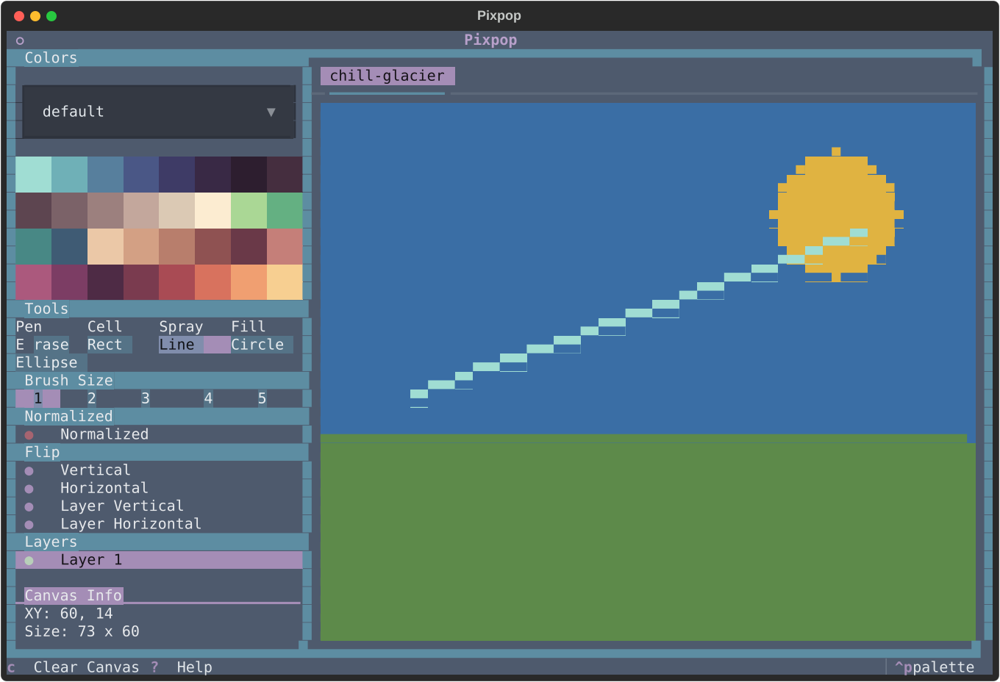

# Drawing Tools

Pixpop ships with eleven tools, selectable from the tool picker or by cycling
with ++d++ (next) and ++a++ (previous). Hover any tool button to see its
tooltip.

## Pen

Freehand drawing. Click or drag to paint with the current brush size and pen
color. This is the default tool.

- **Brush size:** ++w++ / ++s++, sizes 1–5. The brush footprint is anchored
  at the cursor's top-left pixel: **1** = 1×1 px, **2** = 2×2 px,
  **3** = 3×3 px, **4** = 4×4 px, **5** = 5×5 px.
- **Single-pixel precision:** at size 1 the pen paints exactly one pixel.
  Hold ++alt++ to offset the cursor down by one pixel, painting the bottom
  half of the cell under the pointer. Also applies to right-click erasing
  while the pen is active.

## Cell

Paints a full terminal cell — both of its stacked pixels — in one click or
drag. Handy for filling solid blocks without switching brush sizes.

- **No brush size:** the cell tool always paints exactly one full cell.
- **Shifted cells:** hold ++alt++ to offset the cursor down by one pixel,
  painting a cell that straddles the bottom half of the cell under the
  pointer and the top half of the one below.

## Spray

Spray-paint effect: each click or drag scatters pixels at random within the
brush radius.

- **Brush size:** ++w++ / ++s++, sizes 1–5 (radius of the spray area)
- **Density:** adjustable via the spray density picker, 1–5
- Supports [normalized mode](#normalized-mode)

## Fill (paint bucket)

Flood-fills the contiguous region under the cursor with the pen color.

## Light / Dark

Adjust the HSL lightness of already-painted pixels on the active layer:
**Light** raises it, **Dark** lowers it. Click or drag over painted pixels;
transparent pixels are left untouched.

- **Brush size:** ++w++ / ++s++, sizes 1–5
- **Step:** adjustable via the **Light** slider, 1–10 (percent of lightness
  per application). The value is shared by both tools.
- **Accumulate:** the **Accumulate** toggle controls what happens when a
  stroke passes over the same pixel again. **On** (default) re-applies the
  step each time, so dragging back and forth progressively lightens or
  darkens; **off** adjusts each pixel at most once per stroke.
- **Half-cell precision:** hold ++alt++ to offset the cursor down by one
  pixel, adjusting the bottom half of the cell under the pointer.

## Eraser

Erases pixels back to the transparent background. Behaves like the pen but
removes paint instead of adding it.

- **Brush size:** ++w++ / ++s++, sizes 1–5
- **Half-cell precision:** hold ++alt++ to offset the cursor down by one
  pixel, erasing from the bottom half of the cell under the pointer.

## Line

Draws a straight line. Click to set the start, drag to see a live preview,
and release to commit.

- **Brush size:** sizes 1–5
- Supports [normalized mode](#normalized-mode)

## Rectangle

Draws a rectangle outline between the drag start and release points, with
live preview.

- **Brush size:** sizes 1–5 (outline thickness)

## Circle

Draws a circle. The drag defines a bounding box; the circle is anchored
inside it, with live preview.

- **Brush size:** sizes 1–5
- Supports [normalized mode](#normalized-mode)

## Ellipse

Draws an ellipse inscribed in the drag bounding box, with live preview.

- **Brush size:** sizes 1–5
- Supports [normalized mode](#normalized-mode)

## Shape tool tips

All shape tools (line, rectangle, circle, ellipse) share the same workflow:

1. **Mouse down** — anchor the shape
2. **Drag** — live preview of the outline
3. **Release** — commit the shape in the pen color

Committing with the **right button** draws the shape in the background color
instead, effectively cutting the shape out of existing paint.

Hold ++alt++ to offset the cursor down by one pixel — the offset applies to
both the anchor (mouse down) and the drag end, so the whole shape shifts
down to the bottom half of the cell. This also applies when committing with
the right button.

## Normalized mode

Because two pixels share one terminal cell, diagonal strokes can look
"steppy". Normalized mode snaps painted pixels to even rows so that strokes
made by the **line**, **circle**, **ellipse**, and **spray** tools form
whole characters — producing smoother, more uniform ANSI art.

Toggle it with the **Normalized** picker in the side panel. It only affects
tools that support it.
